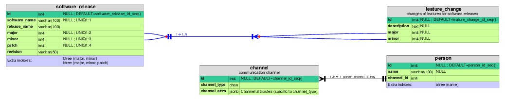

Introduction
============

For now please look at these slides: :download:`20150927_talk.pdf `

**TL;DR** Generate an entyty-relationship diagram for a schema
given as `JSON-table-schema`_.

.. _`JSON-table-schema`: http://dataprotocols.org/json-table-schema

Example of a resulting ERD:

